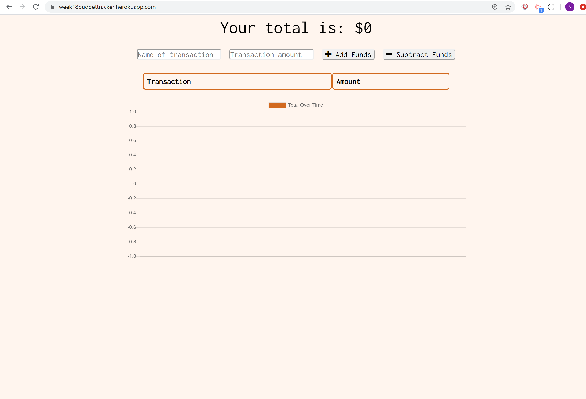
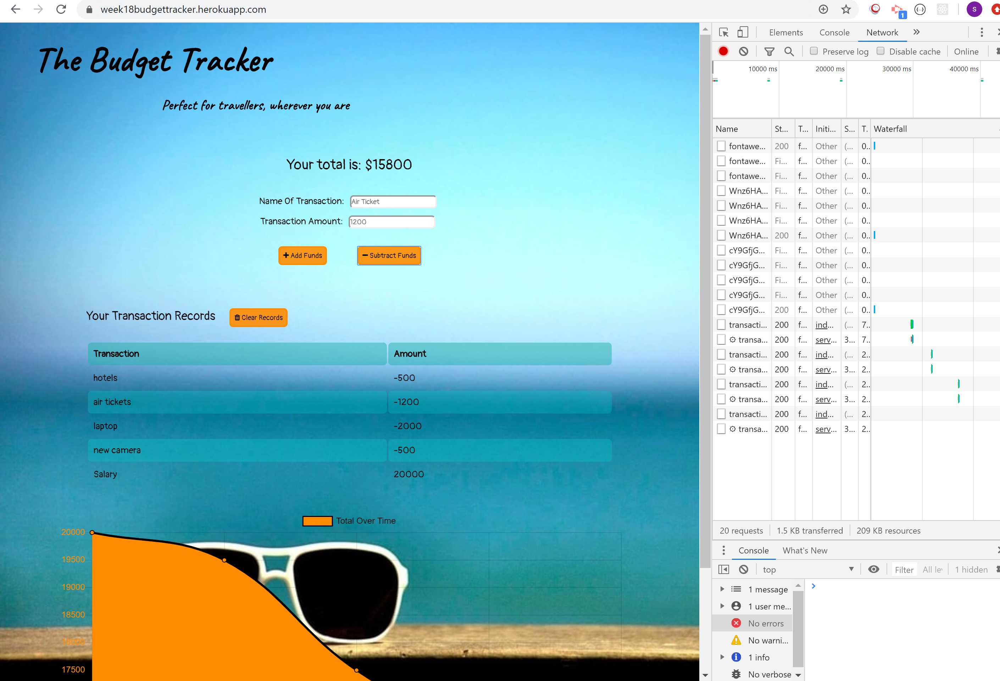
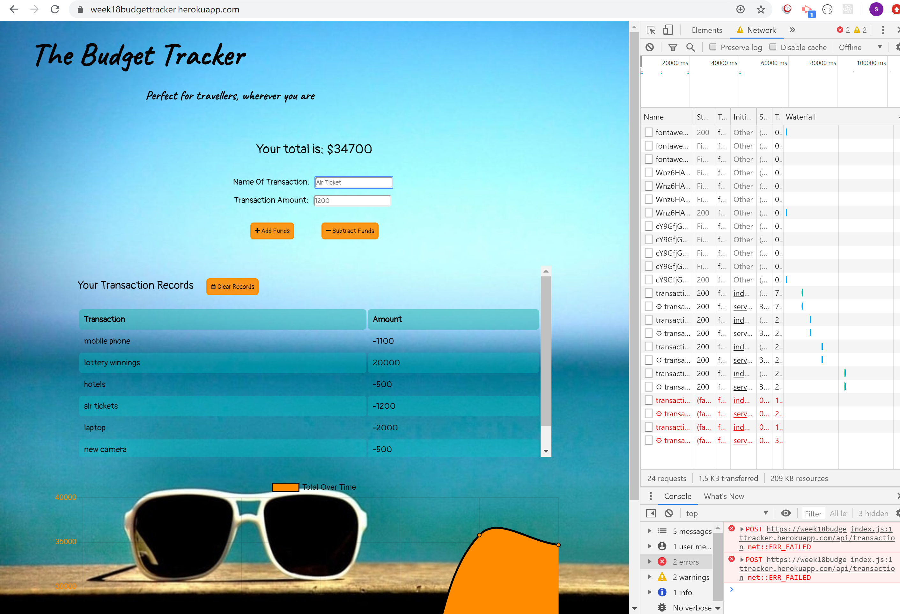
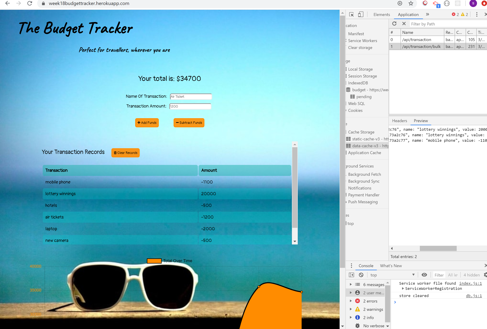
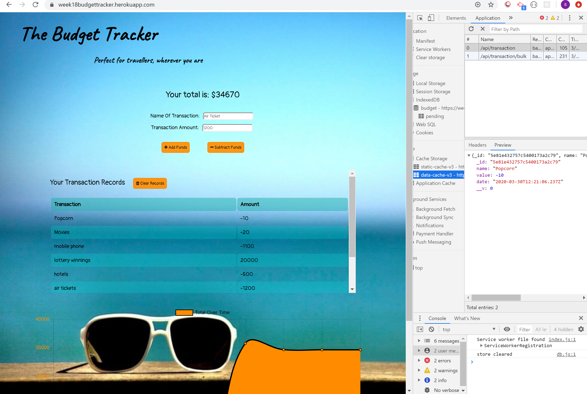

# week18-assignment - The Budget Tracker App

Github link: https://github.com/sevenspell/week18-assignment  

Heroku app link: https://week18budgettracker.herokuapp.com/

## Description 

This project is to create an app that allows users to track their incoming and outgoing money flow while they are travelling, regardless of whether they are online or offline. The app utilizes mongodb (while online) and indexeddb (while offline) to record the transactions, and when the user goes back online, all temporary data stored in indexeddb will be uploaded to mongodb for consolidation.

## Applications Used
MongoDB / Mongoose
Express
Compression
PWA - webmanifest & service-worker.js
TinyJPG for image compression
Minifycode.com for minifying codes

## Usage 

1. Go to Heroku app link: https://week18budgettracker.herokuapp.com/

2. Enter a transaction to start the process. Notice on the top right it indicates 'online'.

3. Continue adding as many transactions as user likes. Notice the "total" will change according to their transactions by adding or deducting from the budget.

4. The latest 2 entries were input while offline. Notice on the top left that it indicates 'offline'. The latest 2 entries are recorded in indexedDB instead.

5. Once it goes back online, there will be an auto update to mongodb as reflected by "/api/transaction/bulk".

6. User can continue to enter new transactions, whether online or offline. The switch between online and offline in the app will not be visible to them, and the entries are consolidated once online.

7. App performance and PWA rating are also high.

## Credits
I got a deeper understanding of the PWA and indexeddb from Wagner (https://wagner-lopes.github.io/) and some guidance from Sandesh.